# Exno:1
Data Cleaning Process

# AIM
To read the given data and perform data cleaning and save the cleaned data to a file.

# Explanation
Data cleaning is the process of preparing data for analysis by removing or modifying data that is incorrect ,incompleted , irrelevant , duplicated or improperly formatted. Data cleaning is not simply about erasing data ,but rather finding a way to maximize datasets accuracy without necessarily deleting the information.

# Algorithm
STEP 1: Read the given Data

STEP 2: Get the information about the data

STEP 3: Remove the null values from the data

STEP 4: Save the Clean data to the file

STEP 5: Remove outliers using IQR

STEP 6: Use zscore of to remove outliers

# Coding and Output

## Data Cleaning Process
import pandas as pd
df = pd.read_csv("Data_set.csv")
df

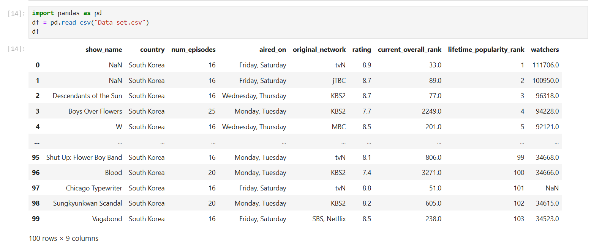

print(df.shape)
df.info()

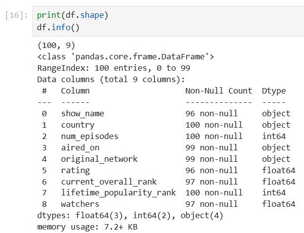

df.isnull()

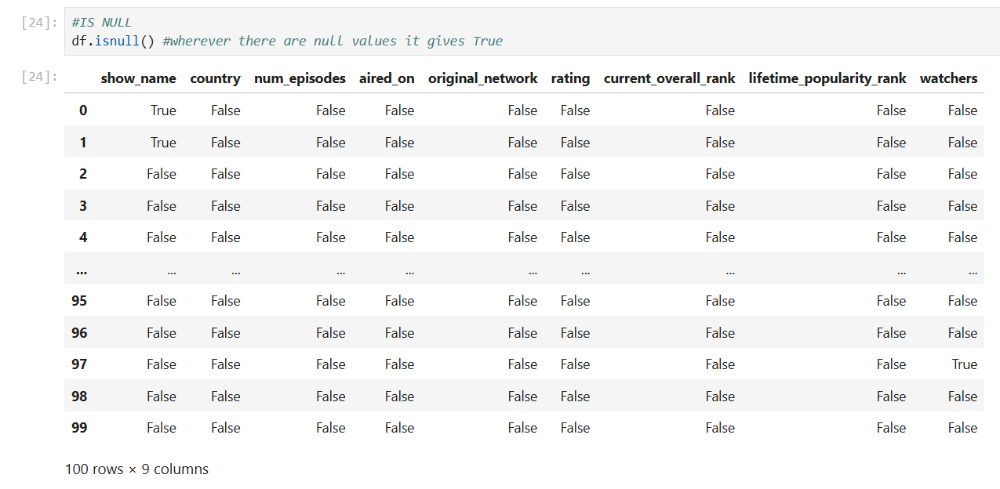

df.notnull()

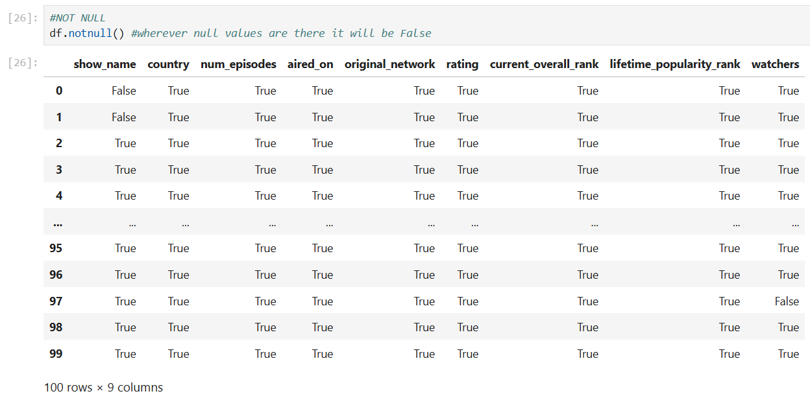

df.dropna(axis=0) 

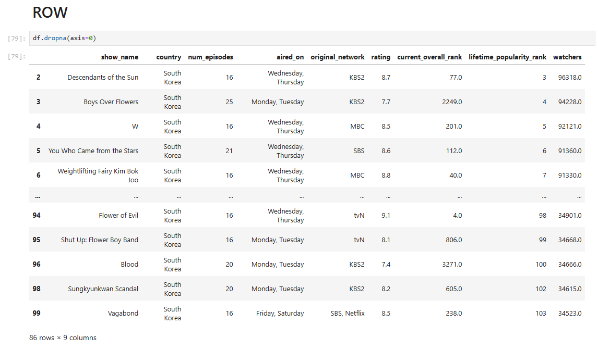 

df.dropna(axis=1)

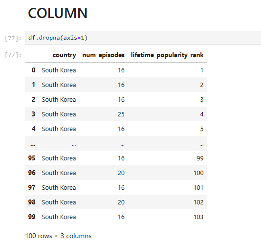 

df.iloc[:3]
df.iloc[1:3]
df.iloc[1:3,1:3]
df.iloc[[1,2,3],[1,2,3]]

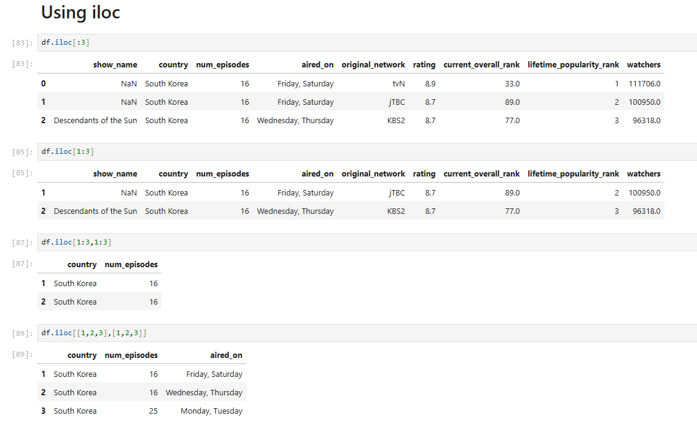 

df.dropna(subset=['show_name'])

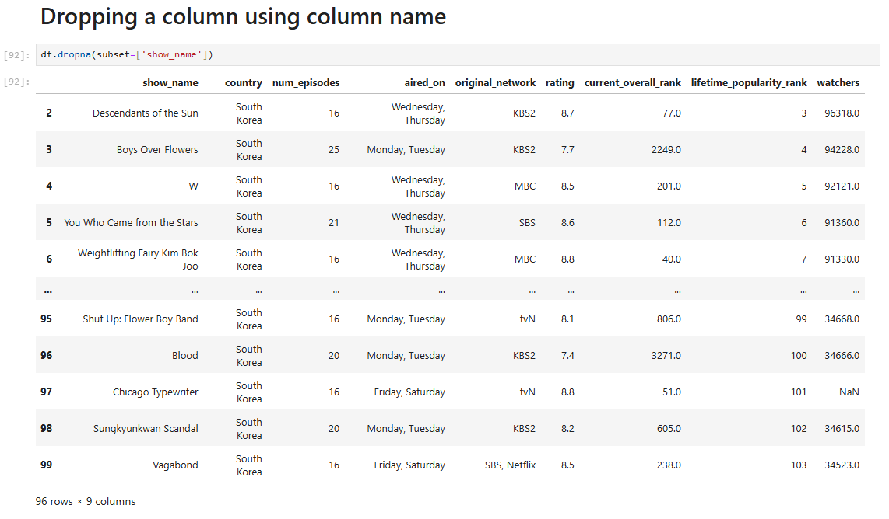 

df.fillna(0)

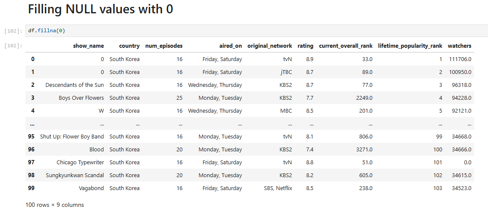

df.fillna(df['rating'].mean())

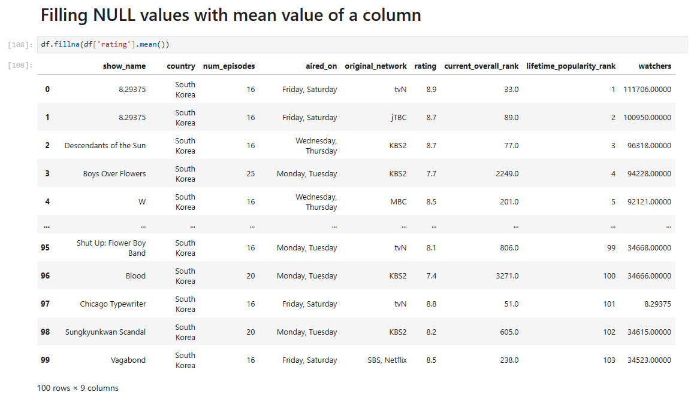 

df.fillna(method='ffill')

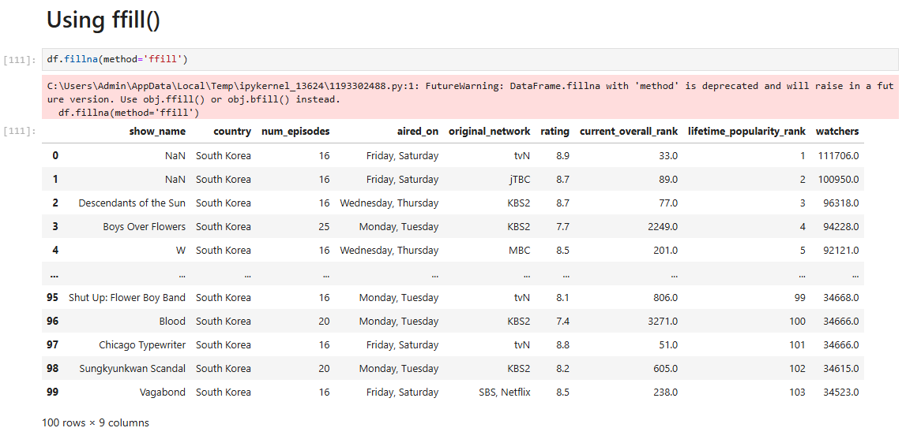 

df.fillna(method='bfill')

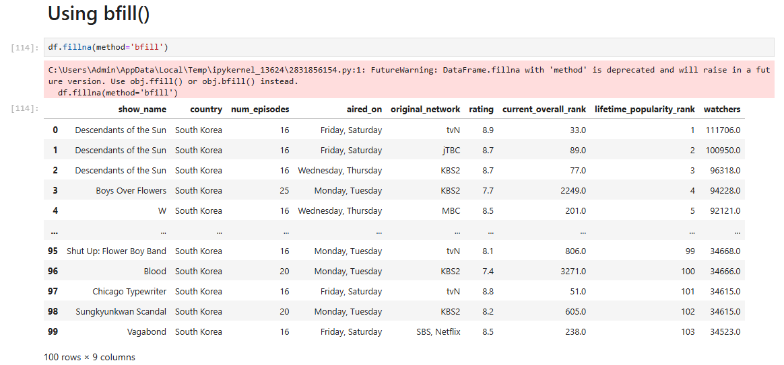 

df.interpolate()

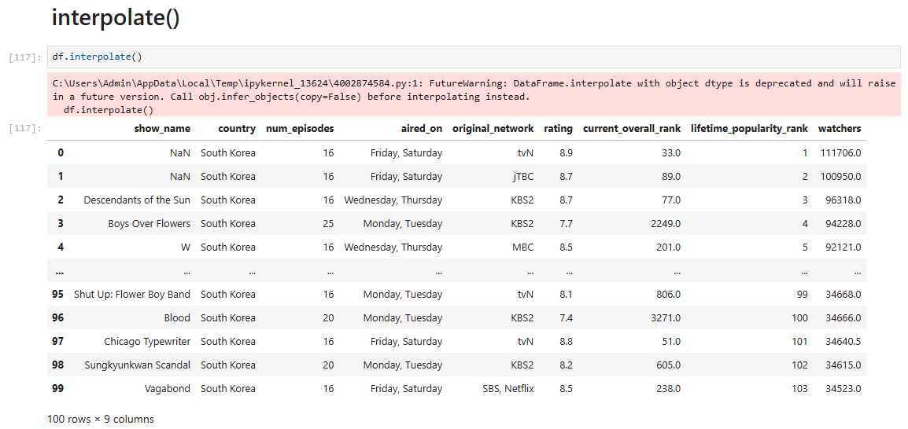  

## Outlier Detection & Removal

# Result
          
The given data has been read and data has been cleaned and the data has been saved to a file.
